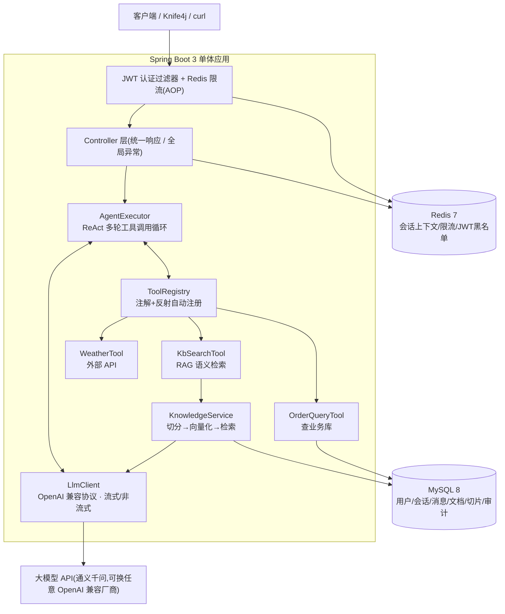
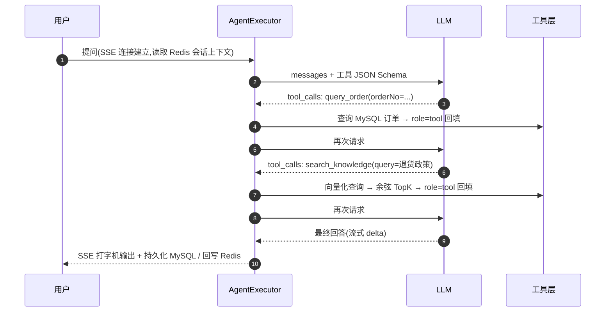

# AInsight — 企业智能知识库与 AI Agent 助手平台

基于 Spring Boot 3 的企业级 AI Agent 后端:用户用自然语言提问,Agent **自主规划并调用工具**
(查询业务数据库、检索企业知识库、调用外部 API),多轮完成任务,SSE 流式返回。

> 核心的 Function Calling / ReAct 执行引擎、RAG 检索链路、向量存储均为**自研实现**,
> 不依赖 LangChain4j / Spring AI 等框架 —— 目标是把每一层机制做透、讲透。

## ✨ 功能特性

- 🤖 **自研 Agent 执行引擎**:基于 OpenAI Function Calling 协议的 ReAct 多轮循环;
  注解 + 反射实现工具自动注册与 JSON Schema 自动生成,新增工具只需一个类;
  最大轮数熔断、超限优雅收尾、工具异常回喂自愈、全量调用审计日志
- 📚 **知识库 RAG**:文档上传 → 异步切分(重叠滑窗 + 句界回退)→ Embedding 向量化 →
  MySQL 持久化 + 内存余弦 Top-K 语义检索;`VectorStore` 接口抽象,可平滑迁移 pgvector / Milvus
- 💬 **多轮对话**:会话上下文冷热分离(Redis 热缓存 + MySQL 全量,Cache-Aside),
  Redis 故障自动降级重建
- ⚡ **SSE 流式输出**:打字机式回答 + 工具执行状态实时推送;
  自研**流式工具调用分片重组**(按 index 归并、arguments 碎片拼接)
- 🔐 **安全**:Spring Security + JWT 无状态认证(HS256 + jti),Redis 登出黑名单,
  BCrypt 密码存储,方法级角色控制
- 🚦 **接口限流**:`@RateLimit` 注解 + AOP + Redis Lua 滑动窗口(原子、无边界突刺),
  支持 USER / IP / GLOBAL 三种维度
- 🧰 **工程化**:统一响应、全局异常两分法、逻辑删除、分页、Knife4j 接口文档、
  Docker Compose 一键环境

## 🏗 架构



一次典型请求(*"帮我查订单 20260726001 的状态,这个订单还能退货吗?"*):



## 🔧 技术栈

| 类别 | 技术 |
|---|---|
| 基础 | Java 17 · Spring Boot 3.5 · Maven |
| 数据 | MySQL 8(业务数据 + 向量持久化)· Redis 7(上下文 / 限流 / 黑名单) |
| ORM | MyBatis-Plus 3.5(分页插件 · 逻辑删除) |
| 安全 | Spring Security · JWT(jjwt)· BCrypt |
| AI | OpenAI 兼容协议(默认通义千问百炼)· 自研 Agent 循环 · 自研 RAG |
| HTTP | WebClient(LLM 流式)· RestClient(外部 API) |
| 文档 | Knife4j / springdoc-openapi |

## 🚀 快速开始

前置:JDK 17+、Docker、[阿里云百炼 API Key](https://bailian.console.aliyun.com/)(或任意 OpenAI 兼容服务)。

```bash
# 1. 启动 MySQL + Redis(首次自动建表并导入种子数据)
docker compose up -d

# 2. 配置大模型 API Key(严禁写死在代码/配置中提交)
export AINSIGHT_LLM_API_KEY=sk-your-key        # Windows PowerShell: $env:AINSIGHT_LLM_API_KEY="sk-xxx"

# 3. 启动应用
mvn spring-boot:run

# 4. 打开接口文档调试(内置账号 admin / admin123,登录后右上角 Authorize 粘贴 token)
# http://localhost:8080/doc.html
```

上传一份知识库文档(仓库自带样例):

```bash
TOKEN=...   # 登录接口获取
curl -X POST http://localhost:8080/api/kb/documents \
  -H "Authorization: Bearer $TOKEN" -F "file=@docs/sample-kb-aftersales.md"
```

体验 Agent 多工具协作(SSE 流式):

```bash
curl -N -X POST http://localhost:8080/api/chat/agent/stream \
  -H "Authorization: Bearer $TOKEN" -H "Content-Type: application/json" \
  -d '{"question":"帮我查一下订单 20260726001 的状态,这个订单还能退货吗?"}'

# event:meta        {"conversationId":1}
# event:tool_call   {"tool":"query_order","arguments":"{\"orderNo\":\"20260726001\"}"}
# event:tool_result {"tool":"query_order","success":true,"costMs":18}
# event:tool_call   {"tool":"search_knowledge","arguments":"{\"query\":\"退货政策\"}"}
# event:tool_result {"tool":"search_knowledge","success":true,"costMs":420}
# event:delta       {"text":"您"} ...(打字机)
# event:done        {"llmRounds":3,"toolCalls":2,"costMs":8432}
```

## 📡 核心接口

| 方法 | 路径 | 说明 |
|---|---|---|
| POST | /api/auth/register · /login · /logout | 注册 / 登录(IP 限流)/ 退出(JWT 黑名单) |
| GET | /api/user/me | 当前用户信息 |
| POST | /api/chat/agent | Agent 对话(非流式,带会话记忆) |
| POST | /api/chat/agent/stream | Agent 对话(SSE 流式) |
| GET/POST/DELETE | /api/chat/conversations… | 会话分页 / 新建 / 历史消息 / 删除 |
| POST | /api/kb/documents | 上传文档(txt/md/pdf,异步切分向量化) |
| GET | /api/kb/search | 语义检索直测 |

完整接口与调试见 `/doc.html`。

## 📂 项目结构

```
src/main/java/com/ainsight/
├── common/      统一响应 Result/PageResult · 业务异常 · 全局异常处理
├── config/      Security / MyBatis-Plus / Knife4j / LLM / RAG / 异步 等配置
├── security/    JwtUtil · 认证过滤器 · 401/403 统一出口 · SecurityUtils
├── user/        注册登录 · 角色
├── agent/
│   ├── core/    AgentExecutor(ReAct 循环)· ToolRegistry(注解+反射)· 审计
│   ├── llm/     LlmClient(流式/非流式/Embedding)· OpenAI 协议 DTO
│   └── tools/   OrderQueryTool · WeatherTool · KbSearchTool(可插拔)
├── knowledge/   文档解析 · TextChunker · VectorStore 抽象 + 内存实现 · 启动加载
├── chat/        会话 · 消息 · Redis 上下文 · SSE
└── infra/       @RateLimit + Redis Lua 滑动窗口限流
```

## 💡 关键设计决策

1. **自研而非框架**:Agent 循环 ~200 行,自研换来对消息序列、分片重组、异常路径的完全掌控
2. **工具即插件**:`AgentTool` 接口 + Spring 容器收集 + 反射生成 Schema,参数与说明书单一事实来源
3. **错误即观察**:工具异常不抛 500,转为文本喂回模型自愈
4. **向量方案分级**:万级切片用"MySQL 持久化 + 内存暴力余弦"(O(n·d) 实测毫秒级),
   `VectorStore` 接口预留 ANN 升级路径
5. **上下文只存文本消息**:省 token,并规避裁剪切断 tool 消息配对的协议陷阱
6. **降级优先**:Redis 故障时上下文自动走 MySQL 重建,缓存挂了功能不挂
7. **无状态 + 极小状态**:JWT 主体无状态,登出黑名单仅存"提前作废的 jti",TTL 自清理
8. **一切外部依赖有超时**:LLM 60s、外部 API 10s、SSE 事件间隔超时

## 📈 可扩展方向

多实例部署(向量索引迁移 pgvector / Milvus)、检索重排(rerank)、上下文摘要压缩、
Refresh Token、工具人工确认(human-in-the-loop)、单元/集成测试、CI/CD。

## License

MIT © [Xiaope555](https://github.com/Xiaope555)
